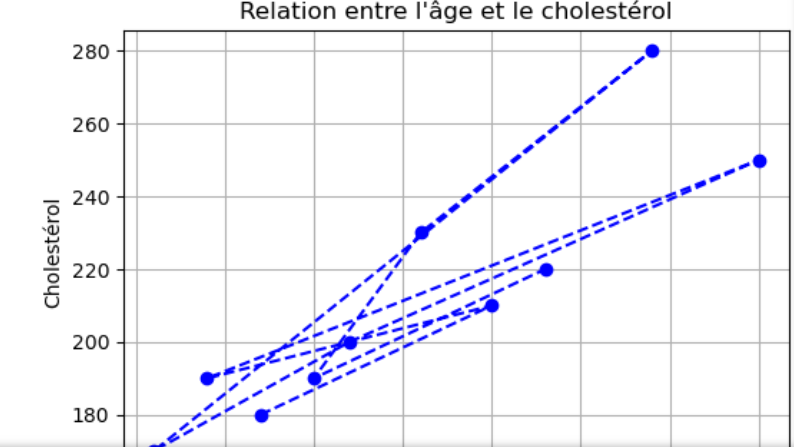
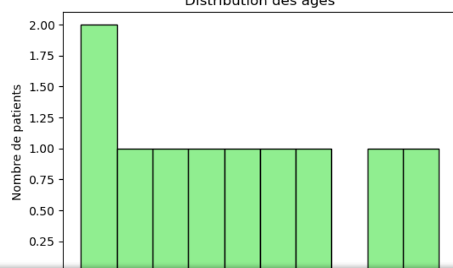

🏥 Hospital Data Analysis

Ce projet présente une analyse complète des données hospitalières à partir d’un fichier CSV (patients.csv).

L’objectif est de visualiser, explorer et résumer les informations des patients à l’aide de Python, Pandas et Matplotlib.

🔹 Étapes principales du projet

1️⃣ Chargement des données

Le script lit le fichier patients.csv à partir du dossier data/ et affiche :

Le répertoire de travail actuel

Le contenu du dossier parent

Les premières lignes du tableau de données

2️⃣ Analyse des données

L’analyse comprend :

Les informations générales sur les colonnes

Les statistiques descriptives (âge, coût, cholestérol, etc.)

La répartition des patients par sexe et par diagnostic

3️⃣ Visualisations

Le notebook génère plusieurs graphiques :

Âge vs Cholestérol → relation entre ces deux variables

Histogramme des âges → répartition des patients selon l’âge

4️⃣ Export des résultats

Les statistiques principales sont enregistrées dans un fichier CSV :

data/statistics\_summary.csv

📊 Exemples de graphiques

Relation entre l’âge et le cholestérol

Distribution des âges

⚙️ Technologies utilisées

Python 3.x

Pandas

Matplotlib

NumPy

👨‍💻 Auteur

Abdallah Mohamed Mesbahi

Master 1 – Python Avancé (2025)

